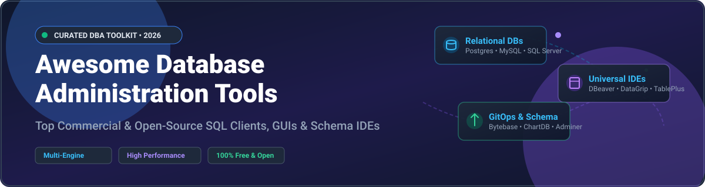

# Awesome Database Administration Tools 🛠️⚡

  

  
  
  
  
  

---

## 🌟 Overview & Market Insights 🚀

Welcome to the ultimate curated list of **Database Administration (DBA) Tools**, **SQL Clients**, **Database GUIs**, and **Schema Management Solutions**. Whether you are managing PostgreSQL, MySQL, SQL Server, Oracle, SQLite, MongoDB, or Redis, this collection covers top-tier commercial software and community-driven open-source projects.

### 📊 Market Size & Industry Structure 📈
The global **Database Management & Administration Tools Market** is estimated at **$18.5 Billion (2026)** and is projected to expand at a CAGR of **12.4%** through 2030. 

The sector is **moderately fragmented**: 
- High-end enterprise workloads rely heavily on proprietary suites like JetBrains DataGrip, Navicat, Quest Toad, and dbForge.
- Developers and DevOps engineers lean heavily on versatile open-source platforms like DBeaver, Bytebase, pgAdmin 4, and Adminer.
- No single vendor maintains a winner-take-all monopoly, allowing innovation across native desktop clients, web-based IDEs, and GitOps schema migration pipelines.

---

## 📖 Table of Contents 📑

- [💼 Commercial Tools & Paid Database IDEs](#-commercial-tools--paid-database-ides)
- [🔓 Open-Source GitHub Projects](#-open-source-github-projects)
- [🤝 How to Contribute](#-how-to-contribute)
- [💖 Support & Sponsorship](#-support--sponsorship)
- [⚠️ Disclaimer](#-disclaimer)
- [📈 Star History](#-star-history)

---

## 💼 Commercial Tools & Paid Database IDEs 💳

*Sorted by Company Size / Market Valuation (Descending).*

| Tool 🛠️ | Description 📝 | Starting Price 💵 | Free Tier / Trial Limits ⏳ | Company Size / Valuation 🏢 |
|:---|:---|:---|:---|:---|
| **[SQL Server Management Studio (SSMS)](https://learn.microsoft.com/en-us/sql/ssms/)** 🟦 | **Microsoft's official SQL Server administration GUI.** T-SQL scripting, activity monitoring, backup/restore, and index tuning. | **$0** (Included with SQL Server licensing) | **Unlimited Free** (Full feature set, no restriction) | **~$3.1 Trillion Valuation** (Microsoft FY2025: ~$281B revenue) |
| **[MySQL Workbench](https://www.mysql.com/products/workbench/)** 🐬 | **Official Oracle MySQL client.** Visual database design, ER modeling, SQL querying, and server administration dashboard. | **$0** (Open Source GPL Community Edition) | **Unlimited Free** (Community edition completely free) | **~$480 Billion Valuation** (Oracle FY2025: ~$53B revenue) |
| **[Toad for SQL Server](https://www.quest.com/products/toad-for-sql-server/)** 🐸 | **Quest Software's enterprise SQL Server suite.** Automation, index optimization, schema compare, and performance diagnostics. | **$795.00 / user / year** (Standard Edition starting price) | **30-Day Free Trial** (Full functional trial, no free tier) | **~$4.2 Billion Valuation** (Quest Software / Clearlake Capital) |
| **[DataGrip](https://www.jetbrains.com/datagrip/)** 🧠 | **JetBrains' premium multi-engine database IDE.** Smart code completion, refactoring, VCS integration, and support for 50+ DBs. | **$109.00 / year** (Individual Commercial, drops to $65/yr year 3+) | **Free for Non-Commercial** (Students, OS maintainers, hobbyists); **30-Day Free Trial** for commercial | **~$3.5 Billion Valuation** (JetBrains, ~$500M+ ARR) |
| **[Navicat Premium](https://www.navicat.com/)** 🧭 | **Multi-connection database management tool.** MySQL, PostgreSQL, SQLite, Oracle, MariaDB, MongoDB, and Redis support. | **$1,599.00** (Enterprise Perpetual License) | **14-Day Free Trial** (Full capabilities); Non-commercial editon available at $199 | **~$500 Million Valuation** (PremiumSoft CyberTech, ~$50M+ ARR est.) |
| **[dbForge Studio for MySQL](https://www.devart.com/dbforge/mysql/studio/)** 🛠️ | **Devart's IDE for MySQL & MariaDB.** Query builder, schema compare, data generator, and automated reporting. | **$119.95 / year** (Standard Edition starting subscription) | **14-Day Free Trial** (Fully functional trial period) | **~$200 Million Valuation** (Devart, ~$20M+ ARR est.) |
| **[TablePlus](https://tableplus.com/)** ⚡ | **Native, fast SQL client for macOS, Windows, Linux & iOS.** Inline editing, multi-tabs, encrypted connections, and code review. | **$99.00** (Basic 1-device perpetual license) | **Free Forever Tier** (Limited to 2 open tabs, 2 open windows, 2 filters) | **~$100 Million Valuation** (TablePlus Inc., ~$10M+ ARR est.) |

---

## 🔓 Open-Source GitHub Projects 🐙

*Sorted by GitHub Stars_Count (Descending). Stars_Badges link directly to repo stargazers.*

| Repo 📦 | Description 📝 | GitHub_Stars ⭐ |
|:---|:---|:---:|
| **[DBeaver Community](https://github.com/dbeaver/dbeaver)** 🦫 | **The #1 universal database tool.** Supports PostgreSQL, MySQL, SQLite, Oracle, SQL Server, DB2, MariaDB, and MongoDB via JDBC. Includes ER diagrams, SQL autocomplete, data import/export, and rich extensions. |  |
| **[ChartDB](https://github.com/chartdb/chartdb)** 📊 | **Visualize and design your database with a single query.** Instant database diagram editor, reverse-engineer schema to interactive graphs, export DDL scripts with zero signup needed. |  |
| **[Bytebase](https://github.com/bytebase/bytebase)** 🛡️ | **Database DevOps and schema migration management tool.** GitOps workflow, database CI/CD, change reviews, SQL linting, RBAC security controls, and sensitive data masking. |  |
| **[Beekeeper Studio](https://github.com/beekeeper-studio/beekeeper-studio)** 🐝 | **Modern, privacy-focused SQL editor & database manager.** Built with Vue and Electron. Supports MySQL, Postgres, SQLite, SQL Server, CockroachDB, and Oracle. Clean UI with SSL encryption support. |  |
| **[DbGate](https://github.com/dbgate/dbgate)** 🚪 | **Smart cross-platform database manager.** Works in desktop (Electron) and web browser application. Supports MySQL, PostgreSQL, SQL Server, MongoDB, SQLite, and CockroachDB. |  |
| **[Datasette](https://github.com/simonw/datasette)** 🔍 | **An open-source multi-tool for exploring and publishing data.** Instantly transform SQLite databases into interactive web APIs and web applications with rich plugin ecosystem. |  |
| **[CloudBeaver](https://github.com/dbeaver/cloudbeaver)** ☁️ | **Web-based database management system.** Lightweight server providing a web application for PostgreSQL, MySQL, MariaDB, SQLite, and Oracle database administration from any browser. |  |
| **[pgAdmin 4](https://github.com/pgadmin-org/pgadmin4)** 🐘 | **The official administration and development platform for PostgreSQL.** Desktop & web deployment, schema object management, query plan visualizer, backup/restore, and monitoring dashboards. |  |
| **[Mathesar](https://github.com/mathesar-foundation/mathesar)** 📑 | **Intuitive collaborative UI for relational databases.** Enables users of all technical backgrounds to edit data, build schemas, create custom views, and build web tables over PostgreSQL. |  |
| **[Azimutt](https://github.com/azimuttapp/azimutt)** 🗺️ | **Visual database exploration and ER diagram analyzer.** Designed for large, complex relational schemas. Parse SQL DDLs, search tables, analyze relationships, and document data models. |  |
| **[Percona Toolkit](https://github.com/percona/percona-toolkit)** 🧰 | **Advanced command-line tools for MySQL, MariaDB, and MongoDB.** Perform online schema changes (pt-online-schema-change), duplicate index detection, query log analysis, and checksum verification. |  |
| **[Adminer](https://github.com/vrana/adminer)** ⚡ | **Full-featured database management in a single PHP file (~500 KB).** Lightweight drop-in replacement for phpMyAdmin supporting MySQL, MariaDB, PostgreSQL, SQLite, MS SQL, Oracle, and Elasticsearch. |  |
| **[HeidiSQL](https://github.com/HeidiSQL/HeidiSQL)** 🦎 | **Fast, lightweight Windows database client.** Connect to MySQL, MariaDB, PostgreSQL, MS SQL, and SQLite. Manage table structures, edit data grids, export database dumps, and optimize tables. |  |

---

## 🤝 How to Contribute 💡

We welcome community contributions! To suggest a new tool or update existing details:

1. 🍴 **Fork** this repository.
2. ✏️ **Edit** `README.md` following the tabular formatting standards.
3. 🔗 Ensure all product links, pricing tiers, and open-source GitHub repositories are verified.
4. 🚀 **Open a Pull Request** with a brief summary of additions or updates.

See [Awesome-Awesome-Awesome](https://github.com/ishandutta2007/Awesome-Awesome-Awesome) for more awesome lists!

---

## 💖 Support & Sponsorship ☕

If you found this database administration toolkit helpful, please consider giving it a ⭐ **Star**, sharing it with fellow developers and DBAs, or sponsoring the maintainer!

- 🌟 **Star & Fork**: Click the Star button at the top right to show your appreciation!
- ☕ **Buy Me a Coffee / Sponsor**: Support ongoing maintenance via [GitHub Sponsors](https://github.com/sponsors/ishandutta2007).

---

## ⚠️ Disclaimer 📜

- This repository is a **community-curated index** for informational and educational purposes.
- All product names, logos, and brands are property of their respective owners.
- Database tools interact directly with sensitive storage systems; always enforce security best practices, least privilege accounts, and SSL/TLS connection encryption in production environments.

---

## 📈 Star History ⭐

---

  Made with ❤️ for Database Administrators, Data Engineers & Developers worldwide.

